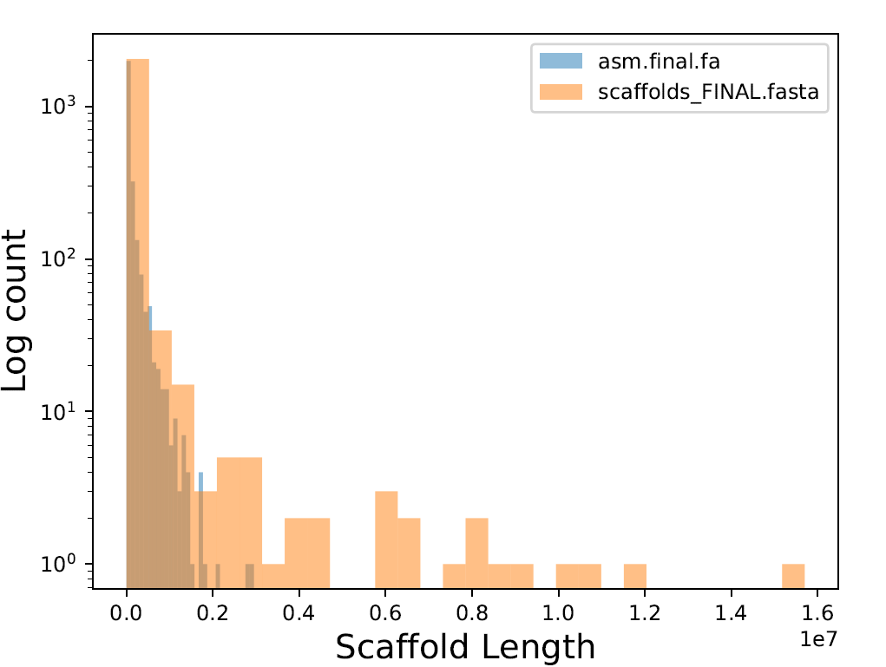

# GACT: The Genome Assembly Comparison Toolkit

> Matt Gitzendanner
>
> University of Florida

I am working on several genome assembly projects and was lacking a good way to compare the output of different assemblers or different parameter sets.

In searching for solutions, I found the [GenomeQC](https://github.com/HuffordLab/GenomeQC)[1] tool and its assembly_stats.py script. This seemed like a good place to start, so I have built on that.

In general, the script takes one or more fasta files, an estimated genome size and computes a number of statistics like numbers and genome coverage of scaffolds of different lengths, N50 and more.

The outputs are a CSV file of stats with each input assembly as a column and a PDF of a histogram comparing the size distributions of the assemblies.

The histogram below is an example of the output comparing two assemblies

The current list of statistics is below:

Genome

Number of scaffolds

Total sum of scaffold lengths

Percent of genome size

Longest scaffold

Shortest scaffold

Total no. scaffolds over 1KBp

Sum of scaffold lengths over 1KBp

Percent genome over 1KBp

Total no. scaffolds over 10KBp

Sum of scaffold lengths over 10KBp

Percent genome over 10KBp

Total no. scaffolds over 25KBp

Sum of scaffold lengths over 25KBp

Percent genome over 25KBp

Total no. scaffolds over 100KBp

Sum of scaffold lengths over 100KBp

Percent genome over 100KBp

Total no. scaffolds over 1MBp

Sum of scaffold lengths over 1MBp

Percent genome over 1MBp

Total no. scaffolds over 10MBp

Sum of scaffold lengths over 10MBp

Percent genome over 10MBp

N50

L50

NG50

LG50

%AT

%GC

%N

Longest N scaffolds

## Citation

1. GenomeQC: A quality assessment tool for genome assemblies and gene structure annotations Nancy Manchanda, John L. Portwood II, Margaret R. Woodhouse, Arun S. Seetharam, Carolyn J. Lawrence-Dill, Carson M. Andorf, Matthew B. Hufford https://bmcgenomics.biomedcentral.com/articles/10.1186/s12864-020-6568-2

